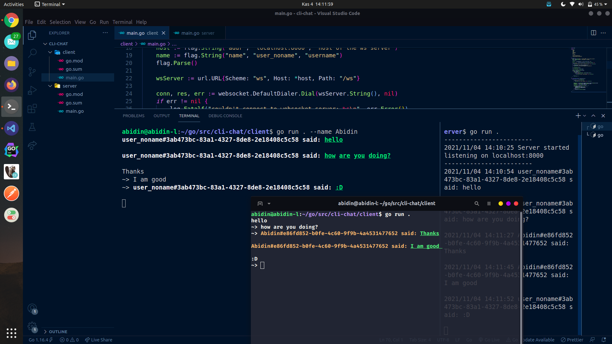
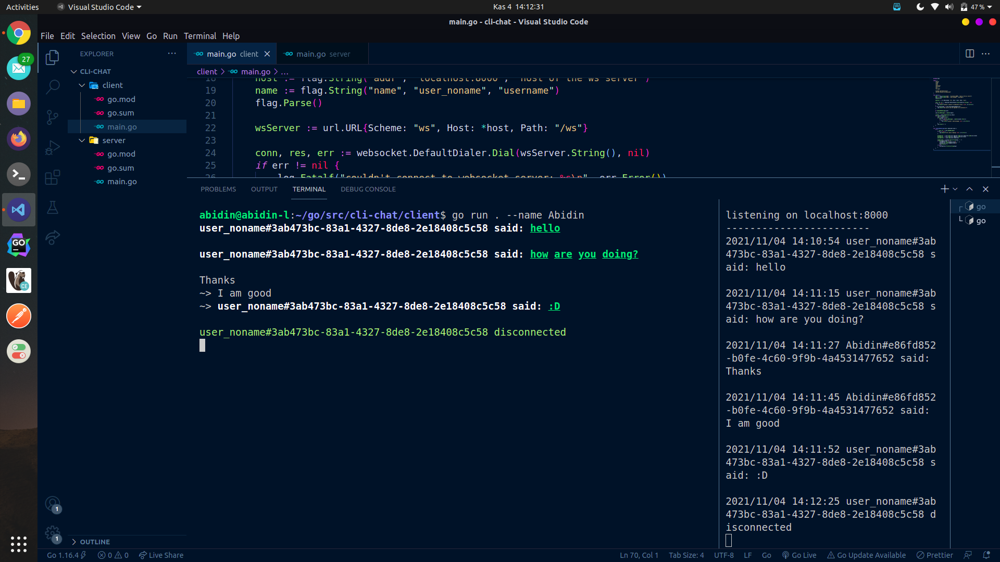

[](https://opensource.org/licenses/MIT)

this app uses websocket protocol to communicate in real time.

both the client and the server are written in golang. 

it uses: 
- <a href="https://github.com/gorilla/websocket">gorilla/websocket</a> package as the websocket library,
- <a href="https://github.com/fatih/color">fatih/color</a> for writing colored text to stdout,
and
- <a href="https://github.com/google/uuid">google/uuid</a> to generate unique client ids.

#### it looks like this:




---

<small>I will refactor the code a bit in the future, if I can. I am also not sure if I can actually install binaries of this using ```go get```.</small>

--- 

